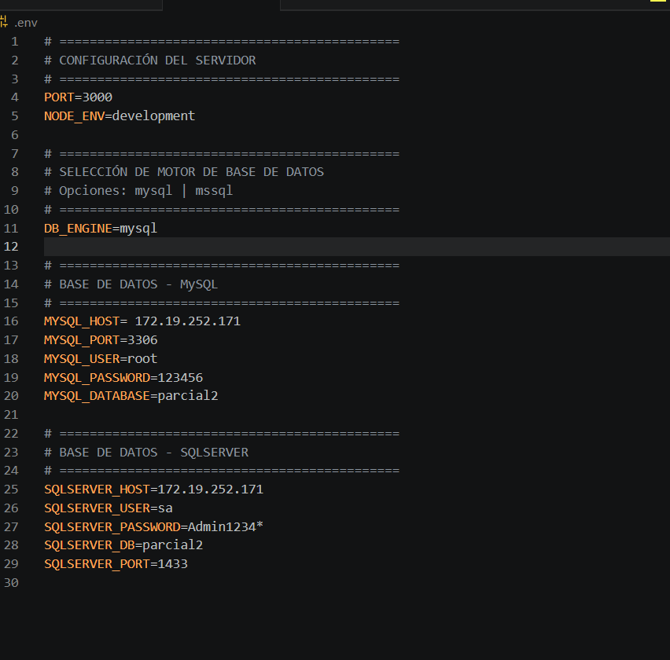

# Documentación Técnica — API REST Parcial 2 Desarrollo Web

**Autor:** Juan Ánez  
**Fecha:** 13 de Mayo de 2026  
**Versión:** 1.0.0  
**Tecnologías:** Node.js, Express.js, Sequelize, MySQL, SQL Server

---

## 📖 Tabla de Contenidos

1. [Introducción](#1-introducción)
2. [Arquitectura y Diseño](#2-arquitectura-y-diseño)
3. [Configuración del Proyecto](#3-configuración-del-proyecto)
4. [Modelos de Datos](#4-modelos-de-datos)
5. [Controladores](#5-controladores)
6. [Rutas API](#6-rutas-api)
7. [Validaciones](#7-validaciones)
8. [Base de Datos](#8-base-de-datos)
9. [Selección Dinámica de Motor](#9-selección-dinámica-de-motor)
10. [Seeders y Datos de Prueba](#10-seeders-y-datos-de-prueba)
11. [Ejecución y Despliegue](#11-ejecución-y-despliegue)
12. [Pruebas y Debugging](#12-pruebas-y-debugging)
13. [Solución de Problemas](#13-solución-de-problemas)
14. [Anexo: Capturas de Pantalla](#14-anexo-capturas-de-pantalla)

---

## 1. Introducción

API RESTful desarrollada como proyecto académico para el parcial de Desarrollo Web. Implementa un sistema de gestión de vehículos y matrículas con doble soporte de bases de datos (MySQL y SQL Server), permitiendo cambiar dinámicamente el motor de base de datos mediante variables de entorno.

### Características principales

- CRUD completo para las entidades `cars` y `tuitions`
- Relación uno a muchos (1:N) entre `cars` y `tuitions`
- Validaciones robustas a nivel de middleware y modelo
- Manejo centralizado de errores con respuestas JSON consistentes
- Soporte para múltiples motores de base de datos con selección dinámica
- Sincronización automática de esquemas (Sequelize `sync`)
- Datos de prueba generados con Faker.js
- Documentación HTTP integrada para VS Code (archivo `http.http`)

---

## 2. Arquitectura y Diseño

### Patrón de arquitectura: MVC con Express.js

```
┌─────────────────────────────────────────────────────────────┐
│                        Express App                          │
│  ┌───────────────────────────────────────────────────────┐  │
│  │                Middlewares Globales                   │  │
│  │  • express.json() • express.urlencoded() • errorHandler│ │
│  └───────────────────────┬───────────────────────────────┘  │
│                          │                                   │
│  ┌───────────────────────▼───────────────────────────────┐  │
│  │                    Routes Layer                        │  │
│  │  /api/cars     → cars.routes.js                        │  │
│  │  /api/tuitions → tuitions.routes.js                    │  │
│  └───────────────────────┬───────────────────────────────┘  │
│                          │                                   │
│  ┌───────────────────────▼───────────────────────────────┐  │
│  │                 Controllers Layer                       │  │
│  │  car.controller.js • tuition.controller.js             │  │
│  │  • Lógica de negocio                                   │  │
│  │  • Validaciones específicas                            │  │
│  │  • Manipulación de modelos                             │  │
│  └───────────────────────┬───────────────────────────────┘  │
│                          │                                   │
│  ┌───────────────────────▼───────────────────────────────┐  │
│  │                Database Layer (db.js)                  │  │
│  │  • MySQL connection • SQL Server connection            │  │
│  │  • Model binding (Car, Tuition)                        │  │
│  │  • Associations (hasMany, belongsTo)                   │  │
│  │  • Motor selection dinámico                            │  │
│  └───────────────────────┬───────────────────────────────┘  │
│                          │                                   │
│  ┌───────────────────────▼───────────────────────────────┐  │
│  │               Models & Config                           │  │
│  │  • Car.js, Tuition.js (definiciones de modelos)        │  │
│  │  • mysql.js, mssql.js (conexiones)                      │  │
│  └─────────────────────────────────────────────────────────┘  │
└─────────────────────────────────────────────────────────────┘
```

### Estructura de carpetas

```
parcial-2-dw-juankA-ez/
├── config/                    # Configuración de BD
│   ├── mysql.js              # Sequelize + MySQL
│   └── mssql.js              # Sequelize + SQL Server (tedious)
├── controllers/              # Lógica de negocio (CRUD)
│   ├── car.controller.js
│   └── tuition.controller.js
├── models/                   # Definiciones Sequelize (factory)
│   ├── Car.js
│   └── Tuition.js
├── routes/                   # Endpoints REST
│   ├── index.js              # Agregador de routers
│   ├── cars.routes.js
│   └── tuitions.routes.js
├── middlewares/              # Middlewares intermedios
│   ├── car.validator.js
│   ├── tuition.validator.js
│   └── errorHandler.js       # Manejador global de errores
├── seeders/                  # Población de datos de prueba
│   ├── cars.seeder.js        # 20 registros fake cars
│   └── tuitions.seeder.js    # 20 registros fake tuitions
├── database/
│   └── db.js                 # Conexión central, modelos y asociaciones
├── fotos/                    # Capturas de pantalla del proyecto
│   ├── .env.png
│   ├── config msql.png
│   ├── configt mssql.png
│   ├── model cars.png
│   ├── models tuitions.png
│   ├── controlador cars.png
│   ├── ruta cars.png
│   ├── ruta tuitions.png
│   ├── car valideition.png
│   ├── tuition valideition.png
│   ├── metodo get por id.png
│   ├── metodo post.png
│   ├── metodo put.png
│   ├── metood delete.png
│   ├── post por id.png
│   ├── datos de faker en cars.png
│   ├── faker en tuitions mysql.png
│   ├── tabla cars en mysql.png
│   ├── tabla tuitions en mysql.png
│   ├── tabla cars en sqlserver.png
│   ├── tabla tuitions en sqleserver.png
│   └── servidor corriendo.png
│   └── servidor corriendo y conectado mysql.png
├── app.js                    # Configuración Express (middlewares)
├── server.js                 # Punto de entrada (conexión + listen)
├── package.json              # Dependencias y scripts npm
├── .env.example              # Variables de entorno de ejemplo
├── .env                      # Variables de entorno locales
├── http.http                 # Requests HTTP de prueba (REST Client)
├── check-tables.js           # Script diagnóstico (temporal)
├── fix-identity.js           # Script corrección IDENTITY (temporal)
├── test-insert.js            # Script prueba inserción (temporal)
└── documentacion.md          # Este documento
```

---

## 3. Configuración del Proyecto

### Dependencias

```json
{
  "dependencies": {
    "dotenv": "^17.4.2",          // Variables de entorno
    "express": "^5.2.1",          // Framework web
    "express-validator": "^7.3.2", // Validación de requests
    "mysql2": "^3.22.3",          // Driver MySQL
    "pg": "^8.20.0",              // Driver PostgreSQL (no usado)
    "pg-hstore": "^2.3.4",        // Soporte PostgreSQL (no usado)
    "sequelize": "^6.37.8",       // ORM
    "tedious": "^19.2.1"          // Driver SQL Server
  },
  "devDependencies": {
    "@faker-js/faker": "^10.4.0", // Datos fake
    "nodemon": "^3.1.14"          // Hot reload
  }
}
```

### Variables de Entorno

Archivo: `.env` (no versionado)

```env
# =============================================
# CONFIGURACIÓN DEL SERVIDOR
# =============================================
PORT=3000
NODE_ENV=development

# =============================================
# SELECCIÓN DE MOTOR DE BASE DE DATOS
# Opciones: mysql | mssql
# =============================================
DB_ENGINE=mysql

# =============================================
# BASE DE DATOS - MySQL
# =============================================
MYSQL_HOST=172.19.252.171
MYSQL_PORT=3306
MYSQL_USER=root
MYSQL_PASSWORD=123456
MYSQL_DATABASE=parcial2

# =============================================
# BASE DE DATOS - SQLSERVER
# =============================================
SQLSERVER_HOST=172.19.252.171
SQLSERVER_USER=sa
SQLSERVER_PASSWORD=Admin1234*
SQLSERVER_DB=parcial2
SQLSERVER_PORT=1433
```

**Captura de referencia:**



#### Descripción de variables

| Variable | Descripción | Valor por defecto |
|----------|-------------|-------------------|
| `PORT` | Puerto del servidor Express | `3000` |
| `NODE_ENV` | Entorno (development/production) | `development` |
| `DB_ENGINE` | Motor de BD activo: `mysql` o `mssql` | `mysql` |
| `MYSQL_HOST` | Host MySQL | `localhost` |
| `MYSQL_PORT` | Puerto MySQL | `3306` |
| `MYSQL_USER` | Usuario MySQL | `root` |
| `MYSQL_PASSWORD` | Contraseña MySQL | — |
| `MYSQL_DATABASE` | Nombre BD MySQL | `parcial2` |
| `SQLSERVER_HOST` | Host SQL Server | `localhost` |
| `SQLSERVER_PORT` | Puerto SQL Server | `1433` |
| `SQLSERVER_USER` | Usuario SQL Server | `sa` |
| `SQLSERVER_PASSWORD` | Contraseña SQL Server | — |
| `SQLSERVER_DB` | Nombre BD SQL Server | `parcial2` |

---

## 4. Modelos de Datos

Los modelos se definen mediante **factory functions** que reciben una instancia de Sequelize y devuelven el modelo registrado. Esto permite crear el mismo modelo en múltiples conexiones (MySQL y SQL Server).

### Modelo: Car (cars)

**Archivo:** `models/Car.js`


```javascript
const defineCarModel = (sequelize) => {
  return sequelize.define('cars', {
    id: { type: DataTypes.INTEGER, primaryKey: true, autoIncrement: true },
    marca: { type: DataTypes.STRING(100), allowNull: false, validate: { ... } },
    // ... resto de campos
  }, {
    tableName: 'cars',
    timestamps: true,
    freezeTableName: true
  });
};
```

**Campos:**

| Campo | Tipo | Restricciones | Validación |
|-------|------|---------------|------------|
| `id` | INTEGER | PK, AI | Auto-generado |
| `marca` | VARCHAR(100) | NOT NULL | 2-100 chars, texto |
| `clase` | VARCHAR(80) | NOT NULL | 2-80 chars, texto |
| `modelo` | INTEGER | NOT NULL | 1900 — (año actual + 1) |
| `cilindraje` | FLOAT | NOT NULL | > 0.1, decimal |
| `capacidad` | INTEGER | NOT NULL | 1-50, entero |
| `pago` | DECIMAL(12,2) | NOT NULL | ≥ 0, máx 2 decimales |
| `createdAt` | TIMESTAMP | AUTO | — |
| `updatedAt` | TIMESTAMP | AUTO | — |

### Modelo: Tuition (tuitions)

**Archivo:** `models/Tuition.js`


```javascript
const defineTuitionModel = (sequelize) => {
  return sequelize.define('tuitions', {
    id: { type: DataTypes.INTEGER, primaryKey: true, autoIncrement: true },
    date_matricula: { type: DataTypes.DATEONLY, allowNull: false, validate: { ... } },
    ciudad: { type: DataTypes.STRING(100), allowNull: false, validate: { ... } },
    car_id: { type: DataTypes.INTEGER, allowNull: false, references: { model: 'cars', key: 'id' } }
  }, {
    tableName: 'tuitions',
    timestamps: true,
    freezeTableName: true
  });
};
```

**Campos:**

| Campo | Tipo | Restricciones | Descripción |
|-------|------|---------------|-------------|
| `id` | INTEGER | PK, AI | Identificador único |
| `date_matricula` | DATE | NOT NULL | Fecha de matrícula (YYYY-MM-DD) |
| `ciudad` | VARCHAR(100) | NOT NULL | Ciudad de registro colombiana |
| `car_id` | INTEGER | NOT NULL, FK | ID del vehículo asociado |
| `createdAt` | TIMESTAMP | AUTO | — |
| `updatedAt` | TIMESTAMP | AUTO | — |

**Relación:** `Tuition` pertenece a `Car` (1:N). Clave foránea `car_id` con `ON DELETE CASCADE`, `ON UPDATE CASCADE`.

---

## 5. Controladores

### Car Controller

**Archivo:** `controllers/car.controller.js`


Funciones CRUD:

| Función | Método | Ruta | Descripción |
|---------|--------|------|-------------|
| `getAllCars` | GET | `/api/cars` | Lista todos los vehículos |
| `getCarById` | GET | `/api/cars/:id` | Obtiene un vehículo por ID |
| `createCar` | POST | `/api/cars` | Crea un nuevo vehículo |
| `updateCar` | PUT | `/api/cars/:id` | Actualiza un vehículo existente |
| `deleteCar` | DELETE | `/api/cars/:id` | Elimina un vehículo |

**Respuesta estandarizada:**

```javascript
const response = (res, statusCode, status, message, data = null) => {
  const payload = { status, message };
  if (data !== null) payload.data = data;
  return res.status(statusCode).json(payload);
};
```

**Manejo de errores Sequelize:**

- `SequelizeValidationError` → 400, lista de campos con error
- `SequelizeUniqueConstraintError` → 409, registro duplicado

### Tuition Controller

**Archivo:** `controllers/tuition.controller.js`

Mismo patrón CRUD, con inclusión de datos relacionados:

```javascript
// GET con include del carro asociado
const tuitions = await Tuition.findAll({
  include: [{ model: Car, as: 'car', attributes: ['id', 'marca', 'clase', 'modelo'] }],
  order: [['id', 'ASC']]
});
```

**Nota:** El alias `'car'` en el `include` debe coincidir con el definido en la asociación `Tuition.belongsTo(Car, { as: 'car' })`.

---

## 6. Rutas API

### Index de Rutas

**Archivo:** `routes/index.js`

```javascript
router.use('/cars', require('./cars.routes'));
router.use('/tuitions', require('./tuitions.routes'));
```

Base path: `/api`

### Cars Routes

**Archivo:** `routes/cars.routes.js`


| Método | Ruta | Controlador | Validaciones |
|--------|------|-------------|--------------|
| GET | `/api/cars` | `getAllCars` | — |
| GET | `/api/cars/:id` | `getCarById` | — |
| POST | `/api/cars` | `createCar` | `carValidationRules` |
| PUT | `/api/cars/:id` | `updateCar` | `carValidationRules` |
| DELETE | `/api/cars/:id` | `deleteCar` | — |

### Tuitions Routes

**Archivo:** `routes/tuitions.routes.js`


| Método | Ruta | Controlador | Validaciones |
|--------|------|-------------|--------------|
| GET | `/api/tuitions` | `getAllTuitions` | — |
| GET | `/api/tuitions/:id` | `getTuitionById` | — |
| POST | `/api/tuitions` | `createTuition` | `tuitionValidationRules` |
| PUT | `/api/tuitions/:id` | `updateTuition` | `tuitionValidationRules` |
| DELETE | `/api/tuitions/:id` | `deleteTuition` | — |

---

## 7. Validaciones

### Validaciones Cars (`middlewares/car.validator.js`)


```javascript
const carValidationRules = [
  body('marca')
    .notEmpty().withMessage('La marca es obligatoria')
    .isString().withMessage('La marca debe ser texto')
    .isLength({ min: 2, max: 100 })
    .trim(),

  body('clase')
    .notEmpty().isString()
    .isLength({ min: 2, max: 80 })
    .trim(),

  body('modelo')
    .notEmpty()
    .isInt({ min: 1900, max: currentYear + 1 }),

  body('cilindraje')
    .notEmpty()
    .isFloat({ min: 0.1 }),

  body('capacidad')
    .notEmpty()
    .isInt({ min: 1, max: 50 }),

  body('pago')
    .notEmpty()
    .isDecimal({ decimal_digits: '0,2' })
    .custom(value => value >= 0 || 'El pago no puede ser negativo')
];
```

### Validaciones Tuitions (`middlewares/tuition.validator.js`)


```javascript
const tuitionValidationRules = [
  body('date_matricula')
    .notEmpty().withMessage('La fecha de matrícula es obligatoria')
    .isDate({ format: 'YYYY-MM-DD', strictMode: true })
    .trim(),

  body('ciudad')
    .notEmpty().isString()
    .isLength({ min: 2, max: 100 })
    .trim(),

  body('car_id')
    .notEmpty().withMessage('El car_id es obligatorio')
    .isInt({ min: 1 }).withMessage('El car_id debe ser un número entero positivo')
    .toInt()
];
```

### Validación a nivel de modelo (Models)

Además de los middleware, los modelos definen validaciones nativas de Sequelize:

**Car:**
- `marca`: notNull, notEmpty, len[2,100]
- `clase`: notNull, notEmpty, len[2,80]
- `modelo`: notNull, isInt, min[1900], max[año actual + 1]
- `cilindraje`: notNull, isFloat, min[0.1]
- `capacidad`: notNull, isInt, min[1], max[50]
- `pago`: notNull, isDecimal, min[0]

**Tuition:**
- `date_matricula`: notNull, isDate (YYYY-MM-DD)
- `ciudad`: notNull, notEmpty, len[2,100]
- `car_id`: notNull, isInt, min[1], validación de existencia en tabla `cars`

---

## 8. Base de Datos

### Configuración MySQL

**Archivo:** `config/mysql.js`


```javascript
const mysqlDB = new Sequelize(
  process.env.MYSQL_DATABASE,
  process.env.MYSQL_USER,
  process.env.MYSQL_PASSWORD,
  {
    host: process.env.MYSQL_HOST,
    port: parseInt(process.env.MYSQL_PORT) || 3306,
    dialect: 'mysql',
    logging: false,
    pool: { max: 10, min: 0, acquire: 30000, idle: 10000 },
    define: {
      timestamps: true,
      underscored: false,
      freezeTableName: true
    }
  }
);
```

### Configuración SQL Server

**Archivo:** `config/mssql.js`


```javascript
const mssqlDB = new Sequelize(SQLSERVER_DB, SQLSERVER_USER, SQLSERVER_PASSWORD || '', {
  host: SQLSERVER_HOST,
  port: parseInt(SQLSERVER_PORT) || 1433,
  dialect: 'mssql',
  dialectOptions: {
    options: {
      encrypt: false,
      trustServerCertificate: false,
      enableArithAbort: true,
      connectTimeout: 30000
    }
  },
  pool: { max: 10, min: 0, acquire: 30000, idle: 10000 },
  define: { timestamps: true, underscored: false, freezeTableName: true }
});
```

### Esquema físico de tablas

#### Tabla `cars`

 

```sql
CREATE TABLE cars (
  id INT PRIMARY KEY IDENTITY(1,1),  -- SQL Server
  id INT PRIMARY KEY AUTO_INCREMENT,  -- MySQL
  marca VARCHAR(100) NOT NULL,
  clase VARCHAR(80) NOT NULL,
  modelo INT NOT NULL,
  cilindraje FLOAT NOT NULL,
  capacidad INT NOT NULL,
  pago DECIMAL(12,2) NOT NULL,
  createdAt DATETIME NOT NULL,
  updatedAt DATETIME NOT NULL
);
```

#### Tabla `tuitions`

 

```sql
CREATE TABLE tuitions (
  id INT PRIMARY KEY IDENTITY(1,1),
  date_matricula DATE NOT NULL,
  ciudad VARCHAR(100) NOT NULL,
  car_id INT NOT NULL,
  createdAt DATETIME NOT NULL,
  updatedAt DATETIME NOT NULL,
  FOREIGN KEY (car_id) REFERENCES cars(id) ON DELETE CASCADE ON UPDATE CASCADE
);
```

---

## 9. Selección Dinámica de Motor

### Implementación en `database/db.js`

```javascript
require('dotenv').config();

const mysqlDB = require('../config/mysql');
const mssqlDB = require('../config/mssql');

// Factory de modelos
const defineCarModel = require('../models/Car');
const defineTuitionModel = require('../models/Tuition');

// Crear modelos en AMBOS motores
const CarMySQL = defineCarModel(mysqlDB);
const TuitionMySQL = defineTuitionModel(mysqlDB);

const CarMSSQL = defineCarModel(mssqlDB);
const TuitionMSSQL = defineTuitionModel(mssqlDB);

// Asociaciones en AMBOS motores
// MySQL
CarMySQL.hasMany(TuitionMySQL, { foreignKey: 'car_id', as: 'tuitions', onDelete: 'CASCADE', onUpdate: 'CASCADE' });
TuitionMySQL.belongsTo(CarMySQL, { foreignKey: 'car_id', as: 'car', onDelete: 'CASCADE', onUpdate: 'CASCADE' });

// SQL Server
CarMSSQL.hasMany(TuitionMSSQL, { foreignKey: 'car_id', as: 'tuitions', onDelete: 'CASCADE', onUpdate: 'CASCADE' });
TuitionMSSQL.belongsTo(CarMSSQL, { foreignKey: 'car_id', as: 'car', onDelete: 'CASCADE', onUpdate: 'CASCADE' });

// Selección del motor según variable de entorno
const DB_ENGINE = process.env.DB_ENGINE || 'mysql';
const Car = DB_ENGINE === 'mssql' ? CarMSSQL : CarMySQL;
const Tuition = DB_ENGINE === 'mssql' ? TuitionMSSQL : TuitionMySQL;

// Exportar modelo activo
module.exports = { Car, Tuition, ... };
```

**Cambio de motor:** Editar `.env`:
```bash
DB_ENGINE=mysql   # Para MySQL
DB_ENGINE=mssql   # Para SQL Server
```

Luego reiniciar el servidor. El sistema automáticamente:
- Usa la conexión configurada
- Selecciona los modelos de ese motor
- Sincroniza solo esa base de datos
- Ejecuta queries en el motor correcto

---

## 10. Seeders y Datos de Prueba

### Cars Seeder

**Archivo:** `seeders/cars.seeder.js`

Inserta 20 vehículos con datos fake generados por Faker.js:


```javascript
const marcas = ['Toyota', 'Chevrolet', 'Mazda', 'Renault', 'Ford', 'Honda', 'Kia', 'Nissan', 'Hyundai', 'Volkswagen'];
const clases = ['Sedán', 'SUV', 'Camioneta', 'Hatchback', 'Coupé', 'Convertible', 'Minivan', 'Pickup', 'Crossover', 'Van'];

const generateFakeCar = () => ({
  marca: faker.helpers.arrayElement(marcas),
  clase: faker.helpers.arrayElement(clases),
  modelo: faker.number.int({ min: 2000, max: 2024 }),
  cilindraje: parseFloat(faker.number.float({ min: 1.0, max: 5.0, fractionDigits: 1 })),
  capacidad: faker.number.int({ min: 2, max: 8 }),
  pago: parseFloat(faker.number.float({ min: 500000, max: 150000000, fractionDigits: 2 }))
});

await Car.bulkCreate(fakeCars, { validate: true });
```

### Tuitions Seeder

**Archivo:** `seeders/tuitions.seeder.js`

Inserta 20 matrículas asociadas a vehículos existentes:


```javascript
const ciudades = [
  'Bogotá', 'Medellín', 'Cali', 'Barranquilla', 'Cartagena',
  'Bucaramanga', 'Cúcuta', 'Pereira', 'Santa Marta', 'Manizales',
  'Ibagué', 'Armenia', 'Valledupar', 'Villavicencio', 'Montería',
  'Popayán', 'Tunja', 'Huila', 'Neira', 'Filandia'
];

// Obtiene IDs de cars existentes y asigna circularmente
const fakeTuitions = Array.from({ length: 20 }, (_, index) => {
  const carIndex = index % cars.length;
  return generateFakeTuition(cars[carIndex].id);
});
```

### Comandos NPM

```bash
npm run seed           # Ejecuta ambos seeders
npm run seed:cars      # Solo cars
npm run seed:tuitions  # Solo tuitions
```

---

## 11. Ejecución y Despliegue

### Requisitos previos

- Node.js v16 o superior
- MySQL Server (puerto 3306) o SQL Server (puerto 1433)
- npm o yarn

### Instalación

 

```bash
# 1. Clonar repositorio
git clone https://github.com/juankAnez/parcial-2-dw-juankA-ez.git
cd parcial-2-dw-juankA-ez

# 2. Instalar dependencias
npm install

# 3. Configurar variables de entorno
cp .env.example .env
# Editar .env con credenciales reales

# 4. Iniciar servidor
npm run dev   # Desarrollo con nodemon
# o
npm start     # Producción
```

El servidor se levanta en `http://localhost:3000`

### Endpoints principales

```
GET    /                    # Ruta raíz — info del API
GET    /api/cars           # Listar todos los vehículos
GET    /api/cars/:id       # Obtener vehículo por ID
POST   /api/cars           # Crear vehículo
PUT    /api/cars/:id       # Actualizar vehículo
DELETE /api/cars/:id       # Eliminar vehículo

GET    /api/tuitions       # Listar todas las matrículas
GET    /api/tuitions/:id   # Obtener matrícula por ID
POST   /api/tuitions       # Crear matrícula
PUT    /api/tuitions/:id   # Actualizar matrícula
DELETE /api/tuitions/:id   # Eliminar matrícula
```

---

## 12. Pruebas y Debugging

### Usando REST Client (VS Code)

El archivo `http.http` contiene 22 requests de prueba agrupados:

#### Métodos GET, POST, PUT, DELETE

    

```http
### GET /api/cars — Listar todos
GET http://localhost:3000/api/cars

### GET /api/cars/:id — Obtener por ID
GET http://localhost:3000/api/cars/1

### POST /api/cars — Crear (éxito)
POST http://localhost:3000/api/cars
Content-Type: application/json

{
  "marca": "Toyota",
  "clase": "SUV",
  "modelo": 2022,
  "cilindraje": 2.5,
  "capacidad": 5,
  "pago": 85000000
}

### POST /api/cars — Validación fallida (cambio)
POST http://localhost:3000/api/cars
Content-Type: application/json

{
  "marca": "",  // ← Error: marca vacía
  "clase": "SUV",
  "modelo": 2022,
  "cilindraje": 2.5,
  "capacidad": 5,
  "pago": 85000000
}
```

**Instalación REST Client:**
1. VS Code → Extensions
2. Buscar: "REST Client"
3. Instalar (Huachao Mao)
4. Abrir `http.http` y pulsar "Send Request" sobre cada request

### Habilita SQL logging

Para debuggear queries SQL:

**config/mysql.js:**
```javascript
logging: console.log,  // ← Cambiar de false a console.log
```

**config/mssql.js:**
```javascript
logging: console.log,
```

Esto imprimirá todas las consultas SQL generadas por Sequelize en consola.

---

## 13. Solución de Problemas

... (contenido existente) ...

---

## 14. Herramientas y Asistencia de IA

### Herramientas Utilizadas

Durante el desarrollo de este proyecto se utilizaron las siguientes herramientas:

| Herramienta | Versión | Uso en el proyecto |
|-------------|---------|-------------------|
| **Visual Studio Code** | 1.92+ | Editor principal de código |
| **REST Client Extension** | 0.12+ | Pruebas de endpoints HTTP directamente desde VS Code |
| **Git** | 2.40+ | Control de versiones y commits |
| **GitHub Desktop / CLI** | — | Gestión de repositorio remoto |
| **MySQL Workbench / phpMyAdmin** | — | Administración y visualización de base de datos MySQL |
| **SQL Server Management Studio (SSMS)** | 18+ | Administración y visualización de base de datos SQL Server |
| **Node.js** | v16+ | Runtime de ejecución |
| **Postman** | 10+ | (Alternativo) pruebas de API |
| **Faker.js** | 10.4.0 | Generación de datos falsos para seeders |

### Asistencia de Inteligencia Artificial

El proyecto se desarrolló con apoyo de asistentes de IA en las siguientes áreas:

#### 1. **Diseño de arquitectura inicial**
- Revisión de estructura MVC propuesta
- Validación de patrones de diseño para Express.js
- Sugerencias de organización de carpetas

#### 2. **Debugging y corrección de errores**
- Identificación del problema de `car_id` con IDENTITY en SQL Server
- Detección de la factory incorrecta (`defineCarModel` vs `defineTuitionModel`)
- Diagnóstico de asociaciones faltantes entre modelos
- Solución del error de validación `min: 1` en `car_id`

#### 3. **Optimización de código**
- Refactorización de `database/db.js` para selección dinámica de motor
- Mejora de mensajes de error en controladores
- Sugerencias de buenas prácticas en Sequelize

#### 4. **Documentación**
- Estructuración del documento `documentacion.md`
- Formato profesional y redacción técnica
- Inclusión de imágenes y referencias visuales
- Generación de tablas comparativas y de configuración

#### 5. **Scripts de diagnóstico**
- Creación de `check-tables.js` para inspección de esquema
- Script `fix-identity.js` para corrección de IDENTITY en SQL Server
- Script `test-insert.js` para verificación de inserciones

### Flujo de trabajo con IA

El proceso iterativo con asistencia de IA siguió este patrón:

1. **Identificación del problema**: Lectura de logs de error y análisis de código
2. **Consulta a IA**: Descripción detallada del error + código relevante
3. **Propuesta de solución**: Análisis de causas raíz y pasos de corrección
4. **Implementación**: Aplicación de cambios en el código
5. **Verificación**: Ejecución de pruebas y validación de resultados
6. **Commit**: Registro de cambios con mensajes descriptivos

### Prompt completo utilizado para generación de documentación

Este es el prompt profesional que se utilizó para solicitar la creación de la documentación completa:

```
Eres un ingeniero de software senior con expertise en Node.js, Express, Sequelize y arquitectura MVC. Debes crear una documentación técnica profesional para un proyecto API REST con las siguientes características:

PROYECTO:
- API REST CRUD completa para 2 tablas relacionadas: `cars` y `tuitions`
- Doble soporte de base de datos: MySQL y SQL Server con selección dinámica
- Motor de selección: variable de entorno `DB_ENGINE` (mysql/mssql)
- Validaciones en 2 niveles: middleware (express-validator) + modelo (Sequelize)
- Relación 1:N entre cars y tuitions con CASCADE
- Seeders con Faker.js (20 registros cada tabla)
- Manejo centralizado de errores
- Respuestas JSON estandarizadas

ESTRUCTURA DEL PROYECTO:
partial-2-dw-juankA-ez/
├── config/ (mysql.js, mssql.js)
├── controllers/ (car.controller.js, tuition.controller.js)
├── models/ (Car.js, Tuition.js — factory functions)
├── routes/ (index.js, cars.routes.js, tuitions.routes.js)
├── middlewares/ (car.validator.js, tuition.validator.js, errorHandler.js)
├── seeders/ (cars.seeder.js, tuitions.seeder.js)
├── database/db.js (conexión, modelos, asociaciones, selección de motor)
├── fotos/ (25 capturas de pantalla)
├── app.js, server.js, package.json, .env, .env.example
└── http.http (requests REST Client)

PROBLEMAS RESUELTOS:
1. Modelo Tuition se creaba con factory de Car → datos iban a tabla cars
2. Falta de asociaciones hasMany/belongsTo → include no funcionaba
3. IDs en SQL Server empezaban en 0 → validación car_id min:1 fallaba
4. Alias incorrecto en includes (`cars` vs `car`)

REQUERIMIENTOS DE DOCUMENTACIÓN:
- Estructura profesional con 14 secciones numeradas
- Incluir TODAS las imágenes de /fotos en su contexto correspondiente
- Código fuente con sintaxis resaltada
- Tablas de especificación de modelos
- Diagrama de arquitectura MVC en ASCII
- Tabla de variables de entorno con descripción
- Explicación detallada de selección dinámica de motor
- Troubleshooting de problemas comunes
- Anexo organizado con tabla de imágenes + ubicación

FORMATO:
Markdown con encabezados jerárquicos, tablas, bloques de código, diagramas ASCII.
No usar lenguaje conversacional, tono técnico y profesional.
Toda imagen debe incrustarse con ``.
```

### Prompt para replicar el proyecto

Si deseas que una IA genere un proyecto similar con las mismas características, utiliza este prompt:

```
Crea una API REST completa con Express.js y Sequelize que cumpla:

1. **Entidades**:
   - `cars`: id, marca (varchar 100), clase (varchar 80), modelo (int), cilindraje (float), capacidad (int), pago (decimal 12,2)
   - `tuitions`: id, date_matricula (date), ciudad (varchar 100), car_id (int, FK a cars)

2. **Relación**: 1:N (Un carro tiene muchas matrículas) con ON DELETE CASCADE

3. **Validaciones**:
   - Cars: marca (2-100 chars), clase (2-80 chars), modelo (1900-año+1), cilindraje (>0.1), capacidad (1-50), pago (≥0)
   - Tuitions: date_matricula (YYYY-MM-DD), ciudad (2-100 chars), car_id (entero positivo, debe existir en cars)

4. **Doble motor de BD**:
   - MySQL (puerto 3306)
   - SQL Server (puerto 1433, tedious)
   - Selección dinámica mediante variable `DB_ENGINE` en .env
   - Factory functions para modelos (registrar en ambas conexiones)
   - Asociaciones configuradas en ambos motores

5. **Controladores CRUD**:
   - GET /api/cars, GET /api/cars/:id
   - POST /api/cars, PUT /api/cars/:id, DELETE /api/cars/:id
   - GET /api/tuitions (con include de car), GET /api/tuitions/:id (con include)
   - POST /api/tuitions, PUT /api/tuitions/:id, DELETE /api/tuitions/:id

6. **Middleware**:
   - express-validator para validación de entrada
   - errorHandler centralizado (captura SequelizeValidationError, UniqueConstraint, FK)
   - Respuestas JSON consistentes: { status, message, data? }

7. **Seeders**:
   - cars.seeder.js: 20 registros fake con Faker.js (marcas reales, clases, años 2000-2024)
   - tuitions.seeder.js: 20 registros fake, asociados a cars existentes (máximo 20)

8. **Archivos de configuración**:
   - config/mysql.js (Sequelize + MySQL2)
   - config/mssql.js (Sequelize + tedious)
   - database/db.js (conexiones, modelos, asociaciones, selección de motor)

9. **Documentación**:
   - README.md completo con tabla de contenidos
   - Capturas de pantalla en carpeta /fotos
   - Archivo http.http con 22 requests REST Client
   - documentacion.md aparte con secciones técnicas detalladas

10. **Requisitos técnicos**:
    - Node.js v16+
    - .env con todas las variables
    - .env.example de referencia
    - scripts npm: start, dev, seed, seed:cars, seed:tuitions
    - sync({ alter: true }) para crear tablas automáticamente

Entregable: Código fuente completo + documentación markdown + capturas de pantalla organizadas.
```

---

## 15. Notas Finales

1. **IDs en SQL Server:** Tras reiniciar el identity con `DBCC CHECKIDENT`, los IDs comienzan en 1 y cumplen la validación `min: 1`.

2. **Asociaciones correctas:** El alias `'car'` en `include` debe coincidir con el `as: 'car'` definido en `Tuition.belongsTo`.

3. **Motor activo:** Solo un motor se usa en producción. El otro se conecta pero no se sincroniza ni se consulta.

4. **Responsabilidad del seeder:** Los seeders usan el modelo `Car` y `Tuition` exportados desde `db.js`, por lo tanto respetan `DB_ENGINE`.

5. **Extensión REST Client:** El archivo `http.http` está listo para usar. Solo requiere tener el servidor corriendo en puerto 3000.

---

**Estado del proyecto:** ✅ Funcional y probado en MySQL y SQL Server  
**Última actualización:** 13 de Mayo de 2026  
**Próximos pasos sugeridos:**
- Agregar paginación a endpoints `GET /api/cars` y `GET /api/tuitions`
- Implementar filtros por ciudad, marca, modelo
- Añadir autenticación JWT
- Swagger/OpenAPI para documentación automática
- Tests unitarios y de integración
- Containerización con Docker

---

**Fin de la documentación**
